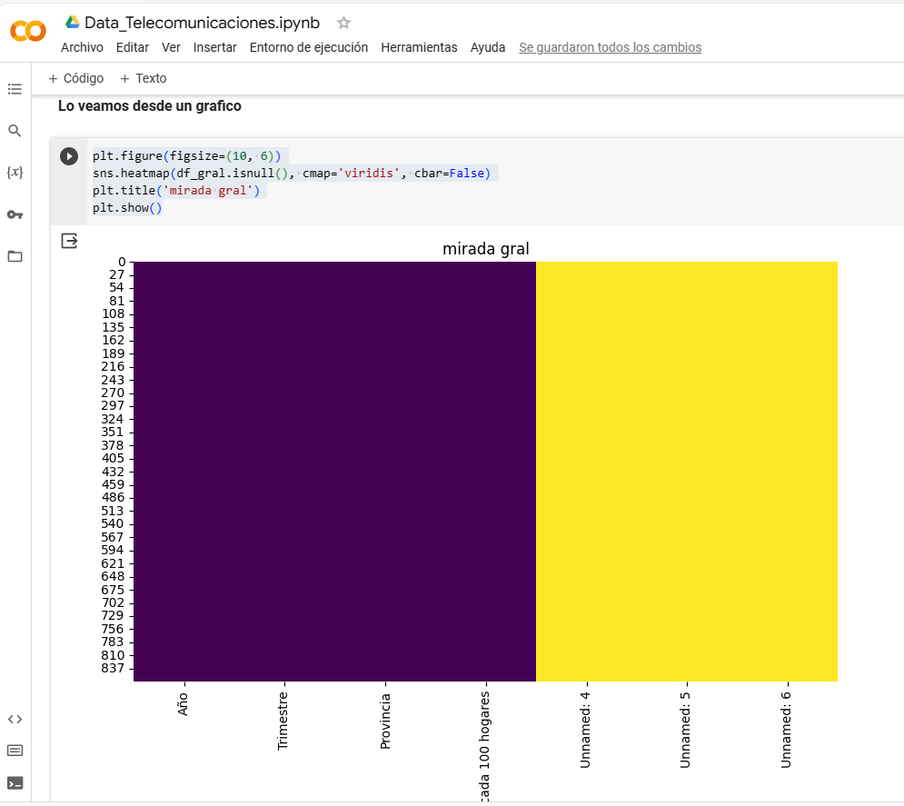
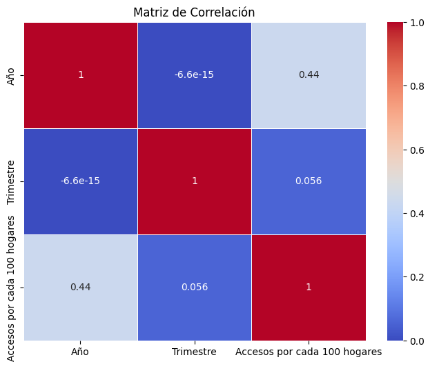
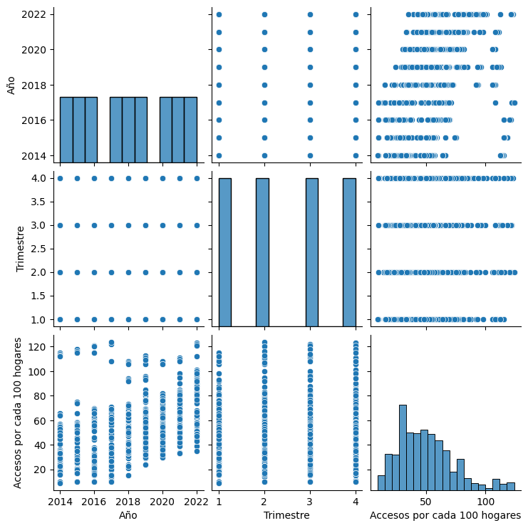
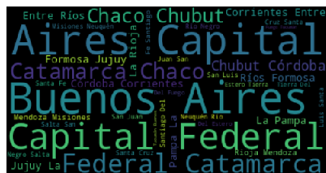
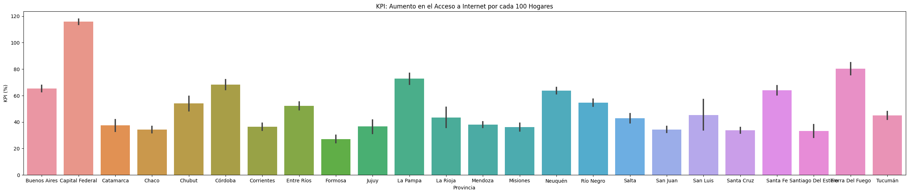
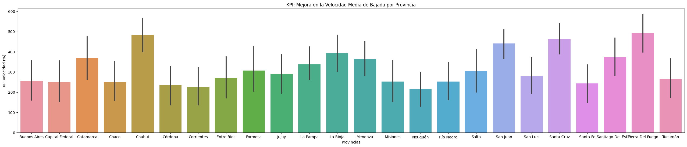

<h1 align='center'>
 <b>PROYECTO INDIVIDUAL Nº2 - Antonio Claudio Ortiz</b>
</h1>
 
# <h1 align="center">**`Telecomunicaciones`**</h1>

## **Empecemos a platear la solucion con los CSV proporcionados:**

**1- Penetracion de Internet fijo.csv**

**2- Penetración por hogares nacional de Internet fijo.csv**

**3- Total nacional de accesos a Internet fijo por banda ancha y banda angosta.csv**

**4- Accesos a banda ancha y banda angosta por provincia.csv**

**5- Serie trimestral de accesos a Internet fijo por tecnología.csv**

**6- Acceso a Internet fijo por tecnología y provincia.csv**

**7- Velocidad Media de bajada de Internet fijo.csv**

**8- Ingresos trimestrales por la prestación del servicio de Internet fijo.csv**

### En primera instancia el proyecto se realizo en :

## DESCRIPCION DEL JUPYTER

#### A cada Dataset se le realizo una lectura previa y una verificacion por medio de graficos de elementos nulos

        df_gral = pd.read_csv('/content/drive/MyDrive/proyect_telecomunicaciones/Penetración de Internet fijo (accesos por cada 100 hogares).csv')

        df_gral.info()

        plt.figure(figsize=(10, 6))
        sns.heatmap(df_gral.isnull(), cmap='viridis', cbar=False)
        plt.title('mirada gral')
        plt.show()

#### Se Observo los elementos de cada columnas 

        df_gral['Accesos por cada 100 hogares'].unique().tolist()

#### Por ultimo se guardo

        df_gral.to_csv("/content/drive/MyDrive/proyect_telecomunicaciones/dfx1_penetracion_internet_fijo.csv", index=True)

#### En esta seccion de analsis se manejo con dataframe:

        df_gral
        df_gral1
        df_gral2
        df_gral3
        df_gral4...

## El Trabajo trabajo tambien tiene una seccion EDA(Analisis exploratorio de datos) 

### Tomenos - EDA - Analisis Exploratorio de Datos- Penetracion Internet fijo

        lectura : dfx1_eda = pd.read_csv('/content/drive/MyDrive/proyect_telecomunicaciones/dfx1_penetracion_internet_fijo.csv')

### Relacion y Exploración entre Variables Categoricas y Numericas

### Correlacion 

        Generacion de la matriz de correlación para entender las relaciones lineales entre las variables numéricas. En este caso, podrías calcular la correlación entre las columnas 'Accesos por cada 100 hogares' y las variables numéricas 'Año' y 'Trimestre'.

        correlacion = dfx1_eda[['Año', 'Trimestre', 'Accesos por cada 100 hogares']].corr()
        print(correlacion)

### Analisis: Autocorrelación:

La diagonal principal (de arriba a la izquierda a abajo a la derecha) muestra la correlación de cada variable consigo misma. Esto siempre es 1.0 porque una variable está perfectamente correlacionada consigo misma.

### Correlación entre Año y Trimestre:

El valor en la fila 'Año' y la columna 'Trimestre', así como en la fila 'Trimestre' y la columna 'Año', es aproximadamente 0. . Esto indica que no hay una correlación lineal fuerte entre el año y el trimestre. Es prácticamente cero, lo que sugiere que no hay una relación lineal significativa entre estas dos variables.

### Correlación entre Año y Accesos por cada 100 hogares:

El valor en la fila 'Año' y la columna 'Accesos por cada 100 hogares', así como en la fila 'Accesos por cada 100 hogares' y la columna 'Año', es aproximadamente 0.435. Esto indica una correlación positiva moderada entre el año y el número de accesos por cada 100 hogares.

### Correlación entre Trimestre y Accesos por cada 100 hogares:

El valor en la fila 'Trimestre' y la columna 'Accesos por cada 100 hogares', así como en la fila 'Accesos por cada 100 hogares' y la columna 'Trimestre', es aproximadamente 0.056. Esto indica una correlación positiva débil entre el trimestre y el número de accesos por cada 100 hogares.

La matriz de correlación sugiere que hay una correlación positiva moderada entre el año y el número de accesos por cada 100 hogares, mientras que la correlación con el trimestre es débil.

## Gráfico de Dispersión: Gráficos de dispersión para visualizar la relación entre 'Año', 'Trimestre' y 'Accesos por cada 100 hogares'.

        sns.pairplot(dfx1_eda[['Año', 'Trimestre', 'Accesos por cada 100 hogares']])
        plt.show()

El gráfico pairplot de Seaborn generado con las variables 'Año', 'Trimestre' y 'Accesos por cada 100 hogares' proporciona una visión visual de las distribuciones individuales y de las relaciones entre pares de estas variables. Aquí hay algunas observaciones típicas que podrías hacer con este gráfico:

### Distribuciones Univariables

 

### Relaciones Bivariadas

### Correlación Visual

### Outliers y Valores Atípicos

### Tendencias Temporales

Ademas se trabaja con nubes de palabras

## Se agrego una seccion de kpis

### Primer KPIS - Mejora del acceso al servicio de internet

        Aumentar en un 2% el acceso al servicio de internet para el próximo trimestre, cada 100 hogares, por provincia.

### Segundo KPI: Mejora en la Velocidad Media de Bajada

        Nueva Velocidad Media considerando una mejora del 5%

# > Armemos nuestro Storytelling

  

### Basicamente mi storytelling esta basada dentro del contexto de una empresa de Desarrollo Cloud Soft, donde al Analista Ortiz se le encomendo el analiss de datos - Telecomunicaciones para ellos tiene objetivos a cumplir teniendo como parametros los KPIS(Indicador clave de rendimiento)

  

  
</p